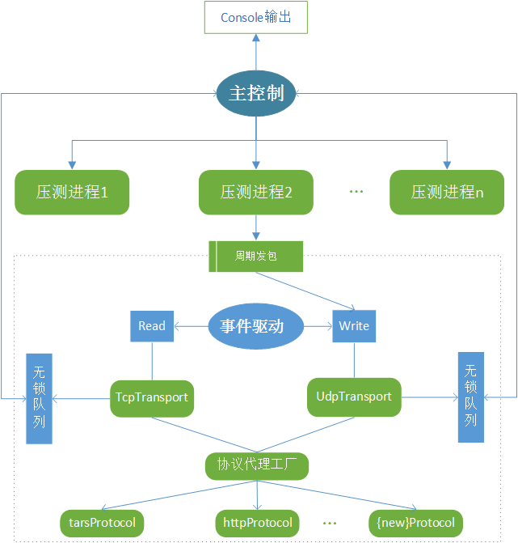

# 简介

**tb**(TarsBenchmark)是专门为 tars 服务量身订做的无码压测工具，具备以下特性：

- 网络高性能：8 核机器 TPS 支持超过 20W/S;
- 通讯扩展性：网络层支持 TCP/UDP 两种协议方式;
- 协议扩展性：应用层支持 Http,Tars 服务压测, 也保持对第三方协议开放;
- 完善的实时统计与监控支持。提供周期内的请求数/TPS/耗时/成功率分布;

## 框架目录

```
├── assets                 #配置存放目录
└── src
    ├── comm               #公共目录，压测主要功能
    │   ├── licote         #处理shell命令行
    │   └── proto          #适配各路协议，支持http/tars/tarjson
    ├── server             #压测服务目录
    │   ├── AdminServer    #压测管理服务, 处理WEBCGI的指令，管理下游NodeServer，定期搜集Node状态
    │   └── NodeServer     #压测执行服务, 接收Admin指令，启动线程执行压测并收集压测过程数据
    └── tool               #压测工具，可以在后台执行，启动进程并执行压测，并收集压测过程数据
```

## 框架结构

tb 工具采用多进程方式设计，主进程负责资源调度和外显，压测进程负责网络收发和统计，网络层可以灵活选择 TCP or UDP; 采用协议代理工厂模式管理各类 service 协议，默认支持 http/tars 协议的压测，支持协议自动发现; 主进程和压测进程之间控制信息通过信号方式交互，数据信息通过无锁共享内存队列交互，以达到最低的资源消耗，主进程会周期地搜集各压测进程的网络统计信息，经过简单汇总之后输出到控制台。



## 使用说明

简单示意

```text
./tb -c 600 -s 6000 -D 192.168.31.1 -P 10505 -p tars -S tars.DemoServer.DemoObj -M test -C test.txt
```

参数说明

```text
  -h                   帮助信息
  -c                   连接数量
  -D                   压测服务器IP，多个IP用';'区隔
  -P                   网络传输端口
  -p                   接口通信协议(tars|http)
  -t(可选)             单个请求超时时间，默认3秒
  -T(可选)             网络层协议，默认tcp
  -I(可选)             压测持续时间(单位秒)，默认1H
  -i(可选)             控制台打印周期时间(单位秒)，默认10秒
  -s(可选)             最大速率限制，为空或0表示自动适配服务最佳速率
  -n(可选)             最大压测进程限制，默认跟CPU核心数
```

详细使用参考[tb 工具编译说明](https://github.com/TarsCloud/TarsDocs/blob/master/benchmark/develop.md)

## <a id="QuickStart"></a>一键安装

采用最新版本的[TarsWeb](https://github.com/TarsCloud/TarsWeb), 就可以实现在线压测 Tars 服务，一键发布步骤如下:

```shell
./install.sh webhost token adminsip nodeip
```

参数说明

```text
webhost                  TarsWeb管理端的url, 例如: http://webhost:3000 (注意不要少了http地址)
token                    TarsWeb管理端的token，可以通过管理端获取http://webhost:3000/auth.html#/token
adminsip                 压测管理服务AdminServer部署的IP地址，AdminServer必须单点部署。
nodeip                   压测节点服务NodeServer部署的IP地址，建议和AdminServer分开部署。
```

**AdminServer**建议和 tarsregistry 部署在一起, **NodeServer**部署成功之后可在管理端扩容，部署的机器越多，支持并行压测能力就越强。

### 使用 Demo


