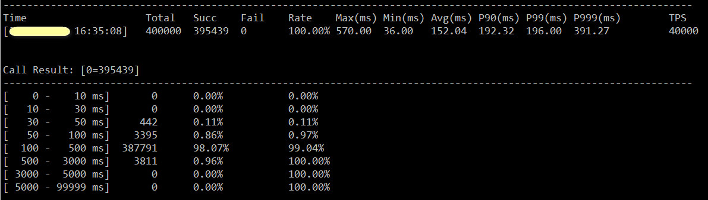
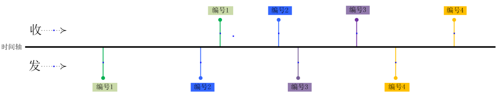
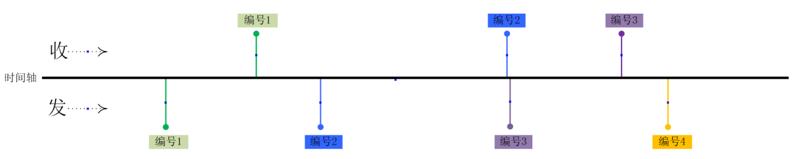

## 简单介绍

tb专门为tars服务量身订做的无码压测工具，利用epoll和多进程，充分发掘压测机的性能，具备以下特性：

 - 网络高性能：8核机器TPS支持超过20W/S;
 - 通讯扩展性：网络层支持TCP/UDP两种协议方式;
 - 协议扩展性：应用层支持Http,Tars服务压测，提供协议开放能力;
 - 完善的实时统计与监控支持。提供周期内的请求数/TPS/耗时/成功率分布;

## 编译说明
tb工具是基于TarsCpp框架开发，所以编译之前请先安装最新TarsCpp开发环境，安装步骤请参考Tars的[TarsCpp的安装文档](https://tarscloud.gitbook.io/tarsdocs/rumen/env/tarscpp)，编译步骤如下，编译完成之后tb工具为可执行程序，存放目录为build/bin。

```
mkdir build; cd build; cmake ..; make;
```

## 使用说明
### 举个例子:
```
./tb -c 600 -s 6000 -D 192.168.31.1 -P 10505 -p tars -S tars.DemoServer.DemoObj -M test -C test.txt
```

### 参数说明：
```
  -h                   帮助信息
  -c                   连接数量
  -D                   压测服务器IP，多个IP用';'区隔
  -P                   网络传输端口
  -p                   接口通信协议(tars|http)
  -t(可选)             单个请求超时时间，默认3秒
  -T(可选)             网络层协议，默认tcp
  -I(可选)             压测持续时间，单位为秒
  -s(可选)             最大速率限制，为空或0表示不限速
  -i(可选)             控制台打印周期时间，单位为秒
  -n(可选)             最大压测进程限制，默认跟CPU核心数

tars协议参数
  -S                   tars服务servant名称
  -M                   tars服务接口方法
  -C                   压测用例文件，详见下文<Tars用例文件生成>和<Tars用例编写说明>

http协议参数
  -H(可选)             :设置Header内容，建议用""修饰
  -C(可选)             :设置Cookie内容，建议用""修饰
  -F(可选)             :post请求内容文件
  -u                   :目标URL地址

```

### Tars用例文件生成
用例文件一般建议使用tars2case工具自动生成，工具可以细化到接口级，用户可以根据业务需要修改参数的值
```
/usr/local/tars/cpp/tools/tars2case Demo.tars --dir=benchmark

cd benchmark && ls
echo.case  test.case
```

### Tars用例编写说明:
文件分为上下部分，用"#"开头行分割，上半部分为RPC参数，下半部分为RPC调用参数的值，跟参数一一对应

- **参数帮助说明**：
 1. 输入参数使用"|"符号进行分割，即tars参数中的","替换为"|"
 2. struct的表示方法是:struct<tag require|optional 字段1,字段2,字段3...>,如果tag从0开始，直接字段1
 3. vector的表示方法是:vector<类型>
 4. map的表示方法:map<key类型,value类型>
 5. 2、3、4可以嵌套使用

- **参值帮助说明**：
 1. <strong>基本类型</strong>的随机值设置：
    <strong>范围随机值</strong>用[1-100]表示，表示在1-100内随机出现, 必须是数字
    <strong>限定随机值</strong>用[1,123,100]表示，表示在1,123,100中随机出现，可以是字符串
 2. 输入参数每个参数一行,也就是tars参数列表中","的地方换成回车
 3. struct的表示方法是:<字段值1,字段值2,字段值3...>
 4. vector的表示方法是:<值1,值2,值3...>
 5. map的表示方法:[key1=val1,key2=val2,key3=val3...]
 6. 3、4、5可以嵌套使用

- **例如**：
```
vector<string>|struct<string, int>|map<string, string>
#######
<abc, def, tt, fbb>
<abc, 1>
[abc=def, dfd=bbb]
```

### 压测结果显示


## 新协议开发
tb工具也可以灵活支持第三方协议的开发开发，如果你服务的协议不是TARS/HTTP，需要适配下服务的协议，三步就能搞定：
 - 1.参考httpProtocol继承Protocol协议类。
 - 2.实现input/encode/decode三个函数方法。
 - 3.实现初始化函数，截取命令行需要的参数。

在开发工作准备前，你需要了解压测的目标服务属于那种模式：


**有序模式**
在模式下压测客户端会按照指定速率匀速向目标服务器发送请求，不依赖服务端的返回，在发送请求的时候，客户端会生成**全局唯一id**给服务端，服务端回包的时候会携带这个id给客户端。
****


**无序模式**
在模式下压测客户端会低于指定速率匀速向目标服务器发送请求，强依赖服务端的返回（一般服务端不回序号给客户端），在发送下一个请求前必须收到上一个请求的响应或超时。以下图为例。


## FAQ
 - tb指定速率何解？
1.速率指定单位是单目标机，如果目标机有n台，统计的TPS=速率*n
2.如果不指定压测速率，tb将全速向目标机发起冲击。

 - tb高性能是如何实现的？
首先，通过事件驱动避免进程的网络IO阻塞，最大程度提升CPU利用率，
其次，工具会根据CPU核数量创建数量相同的压测进程，连接数和压测速率会均分到子进程上。

 - tb压测进程之间数据同步如何同步？
通过无锁共享内存队列实现数据共享，统计结果在主进程输出
